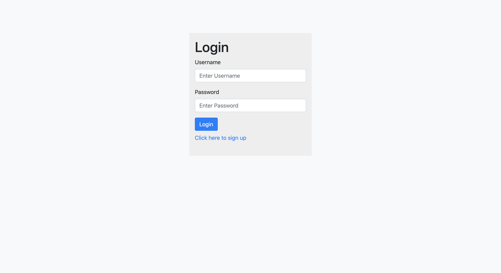
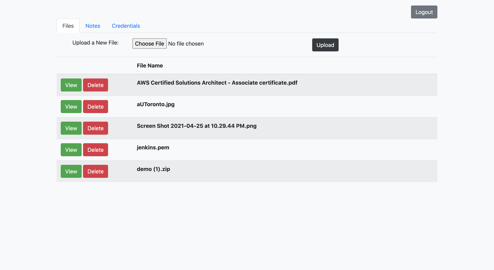
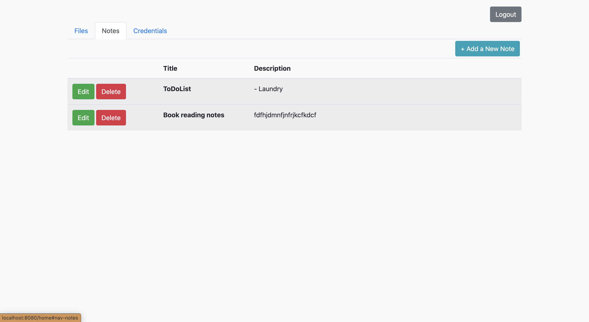
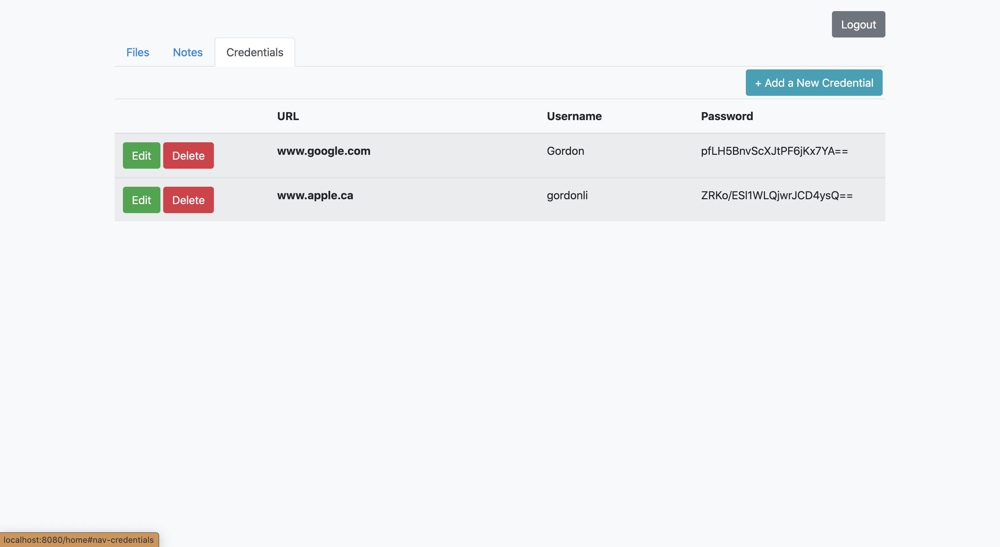

---
# Feel free to add content and custom Front Matter to this file.
# To modify the layout, see https://jekyllrb.com/docs/themes/#overriding-theme-defaults

layout: default
title: CloudStorage Project
---

# Mocking a cloud storage web app

## Description

This is a full stack project where I used Thymeleaf and html to compose a simple UI, and hooked it up with MyBatis and h2 database on backend.

## Some main features include:

- User sign up and login
- Upload and download files
- Create and edit notes
- Store and edit credentials
- Password hashing
- Credential encryption

## Screenshots

### Login page

### Files page

### Notes page

### Credentials page

