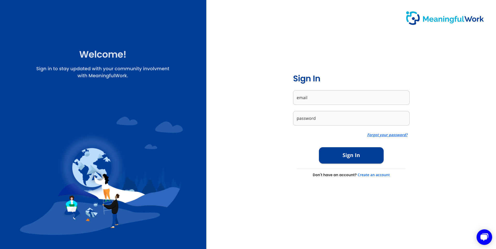
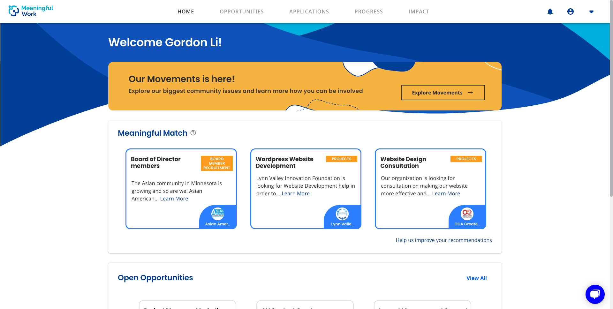
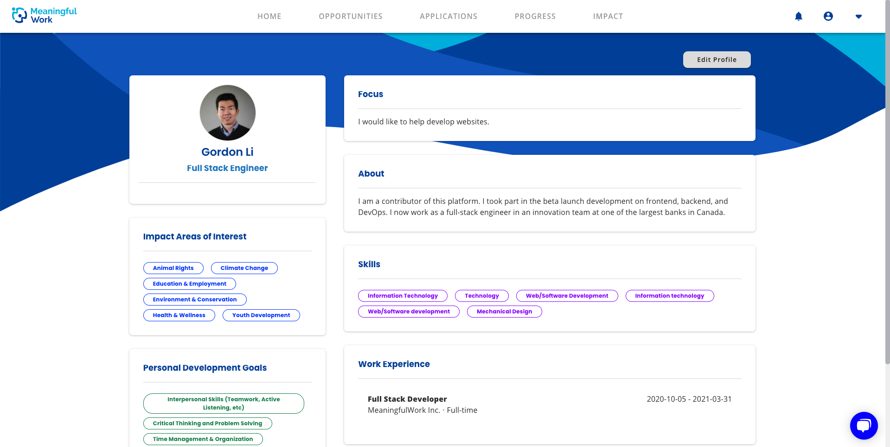

---
# Feel free to add content and custom Front Matter to this file.
# To modify the layout, see https://jekyllrb.com/docs/themes/#overriding-theme-defaults

layout: default
title: MW Project
---

# MeaningfulWork Platform

Checkout this website or sign up <a href="https://app.meaningfulwork.xyz" target="_blank" rel="noreferrer"><b>here</b></a>.

## Description

MeaningfulWork strives to provide a platform that matches corporate professionals who seek to give back to the community with nonprofits that are eager to find talented volunteers to help make positive social impacts.

## Some main features include:

- User sign up and login
- Volunteer: Personalized posting recommendations based on personal skills, impact areas of interest, and personal goals
- Volunteer: Apply to postings, schedule interviews, and tracking volunteer hours
- Company and nonprofit: Send collaboration invite to each other
- Nonprofit: Issue impact report for a volunteer on a project

## Screenshots

### Login page

### Volunteer dashboard page

### Volunteer profile page

You can sign up <a href="https://app.meaningfulwork.xyz" target="_blank" rel="noreferrer"><b>here</b></a> if you are interested in volunteering !

