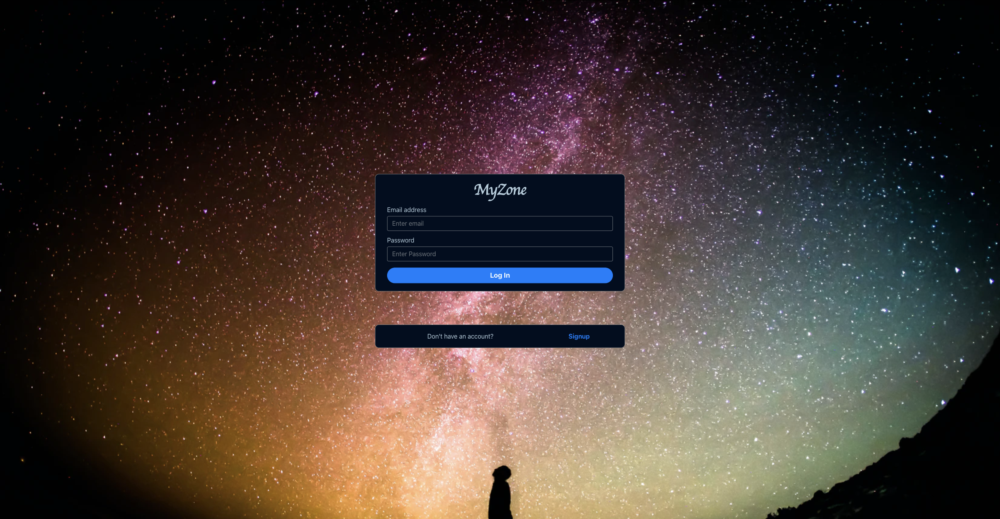
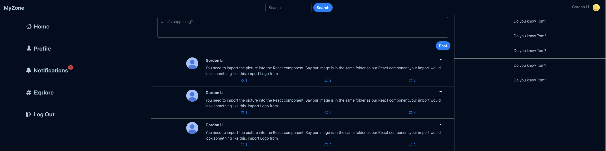

---
# Feel free to add content and custom Front Matter to this file.
# To modify the layout, see https://jekyllrb.com/docs/themes/#overriding-theme-defaults

layout: default
title: MyZone Project
---

# MyZone

## Description

MyZone is the very first hands-on project I did to learn React and Redux.

## Some main features include:

- User sign up and login
- User adds profile avatar
- User posts a piece of microblog
- User likes and comments on a post

## Screenshots

### Login page

### Dashboard page

