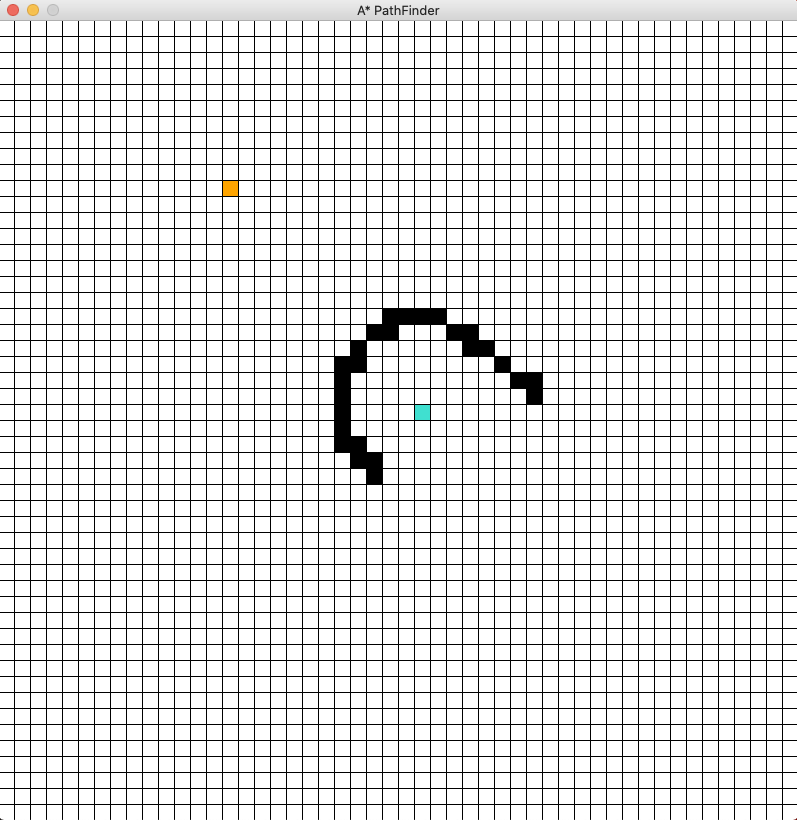
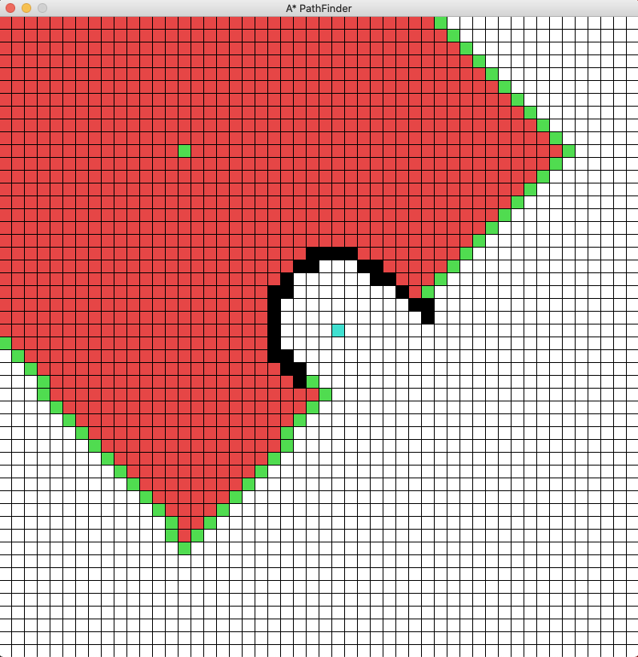
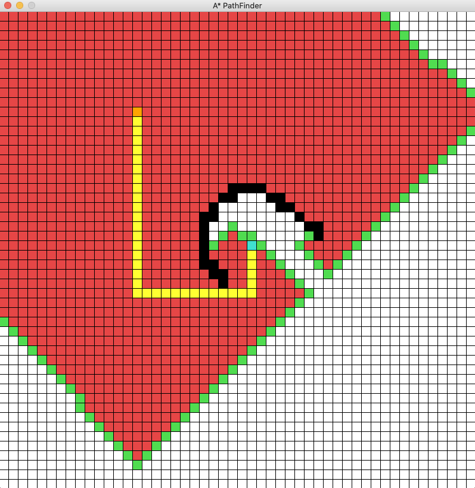

---
# Feel free to add content and custom Front Matter to this file.
# To modify the layout, see https://jekyllrb.com/docs/themes/#overriding-theme-defaults

layout: default
title: Pathfinder Project
---

# Visualize a pathfinding algorithm

## Description

I used Pygame package and OOP to create a simple interactive game to visualize how A* algorithm finds the shortest path between two points with obstacle in between.

## Some main features include:

- Define start and end points
- Define obstacles and walls
- Erase and redraw
- Reset all drawings
- Pathfinding animation

## Screenshots

### Game interface

### Scenario setup

### During animation

### End result demonstration

